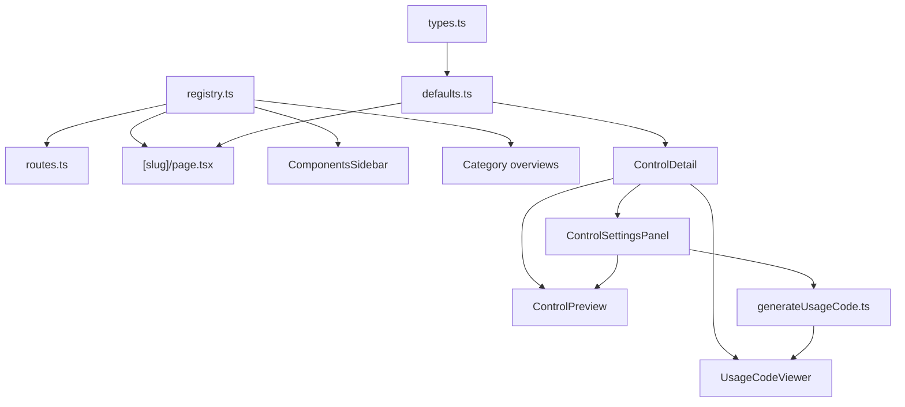

# Architecture

## Registry

**File:** `lib/controls/registry.ts`

The registry is the single source of truth for documented components.

```ts
type ControlDefinition = {
  slug: ControlSlug;
  title: string;
  category: ComponentCategory;   // "content" | "forms" | "overlays"
  componentName: string;
  description: string;
  sourceFiles: string[];
  usesFieldShell: boolean;
};
```

Public helpers:

| Function | Purpose |
|----------|---------|
| `getControl(slug)` | Look up one definition |
| `getControlsByCategory(category)` | All controls in a category, sorted by title (forms uses fixed order) |
| `getAllSlugs()` | All slugs — used by `generateStaticParams` |
| `componentCategories` | Category id + label for sidebar and overviews |
| `categoryDescriptions` | One-line description per category |

Forms order is defined separately in `formsControlOrder` (`lib/controls/types.ts`) so buttons appear before inputs in the sidebar.

## Routes

**File:** `lib/controls/routes.ts`

| Helper | Example output |
|--------|----------------|
| `componentPath()` | `/documentation/components` |
| `componentPath("button")` | `/documentation/components/button` |
| `categoryPath("forms")` | `/documentation/components/forms` |
| `getCategoryFromPath(pathname)` | `"forms"` when on a category overview |
| `getActiveCategoryFromPath(pathname)` | Category for sidebar expand state (overview or detail slug) |

No per-component route files are needed. `app/documentation/components/[slug]/page.tsx` handles all slugs via SSG.

## Types and defaults

**Files:** `lib/controls/types.ts`, `lib/controls/defaults.ts`

Every slug has:

1. A **settings type** in `ControlSettingsBySlug` (e.g. `TextInputSettings`) — shape of demo props.
2. A **default settings object** in `defaultSettings` — initial values for preview and codegen.

`getDefaultSettings(slug)` returns typed defaults for the detail page.

Shared field settings (`mode`, `labelPosition`, `error`, `help`, `required`, …) come from `BaseFieldSettings` in types.

## Control detail pipeline

When you visit `/documentation/components/{slug}`:

```
[slug]/page.tsx
  └── ControlDetail.tsx          Three-column layout (preview | usage | settings)
        ├── ControlPreview.tsx   switch(slug) → live React component
        ├── UsageCodeViewer.tsx  CodeMirror + copy button
        │     └── generateUsageCode.ts   switch(slug) → JSX string
        └── ControlSettingsPanel.tsx     switch(slug) → tweakable demo controls
```

Settings changes flow up from `ControlSettingsPanel` → `ControlDetail` state → `ControlPreview` and `generateUsageCode` re-render together.

### Usage code generation

**File:** `lib/controls/generateUsageCode.ts`

`generateUsageCode(slug, settings)` produces copy-paste JSX reflecting current settings. Each slug has its own case that maps settings to prop strings. Import paths point at `@/components/fields`.

## Icons

**File:** `lib/controls/componentIcons.ts`

Maps slugs and categories to Font Awesome icons for the overview grid and sidebar. Helpers:

- `getOverviewIcon()` — main Overview link
- `getCategoryIcon(category)` — Content / Forms / Overlays headings
- `getComponentIcon(slug)` — per-component nav and cards

**File:** `components/development/ComponentIcon.tsx`

Thin wrapper around `FontAwesomeIcon`. Icons use `color: inherit` so they match parent link or heading colour.

## Static generation

```ts
// app/documentation/components/[slug]/page.tsx
export function generateStaticParams() {
  return getAllSlugs().map((slug) => ({ slug }));
}
```

All 47 detail pages are pre-rendered at build time.

## Data flow diagram


